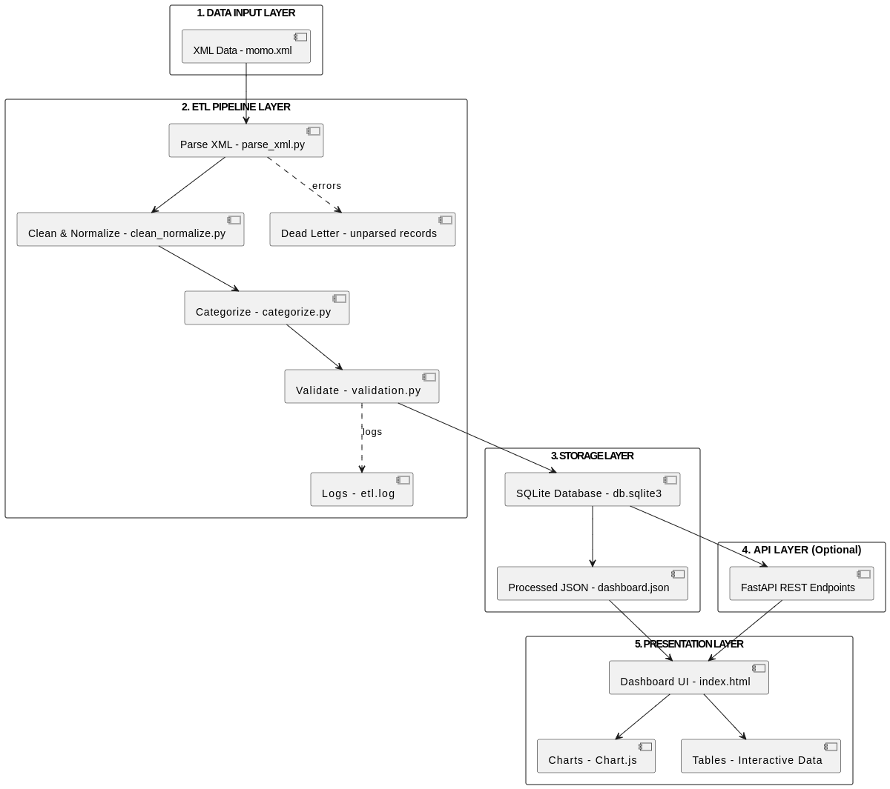

# MoMo SMS Analytics

## Team Members

* Abdul Kudus Zakaria Mukhtaru
* Ariane Itetero
* Modupe Akanni
* Peter Mfitumukiza
* Daniel Gakumba Ntwali

## Project Description

This project processes MoMo (Mobile Money) SMS data in XML format, cleans and categorizes the data, stores it in a relational database, and provides a frontend interface to analyze and visualize the data. The application demonstrates enterprise-level fullstack development with backend data processing, database management, and frontend development.

For Week 2, the project also focuses on database design and implementation, including ERD design, SQL schema implementation, and JSON data modeling.

## Project Structure

```text
.
├── README.md
├── .env.example
├── requirements.txt
├── index.html
├── docs/
│   ├── api_docs.md
│   ├── Database Design Document.pdf
│   ├── erd_diagram.pdf
│   └── json_mapping.md
├── database/
│   └── database_setup.sql
├── examples/
│   └── json_schemas.json
├── web/
│   ├── styles.css
│   ├── chart_handler.js
│   └── assets/
│       └── architecture.png
├── data/
│   ├── raw/                          # XML input (git-ignored)
│   ├── processed/
│   │   └── dashboard.json
│   ├── db.sqlite3                    # Local DB (git-ignored)
│   └── logs/
│       ├── etl.log
│       └── dead_letter/
├── etl/
│   ├── config.py
│   ├── parse_xml.py
│   ├── clean_normalize.py
│   ├── categorize.py
│   ├── load_db.py
│   └── run.py
├── api/                              # Optional (bonus)
│   ├── app.py
│   ├── db.py
│   └── schemas.py
├── scripts/
│   ├── run_etl.sh
│   ├── export_json.sh
│   └── serve_frontend.sh
└── tests/
    ├── test_parse_xml.py
    ├── test_clean_normalize.py
    └── test_categorize.py
```

##  Database Design Components

### Entity Relationship Diagram (ERD)

The ERD was created using a professional diagramming tool and includes the following core entities:

* Transactions
* Users / Customers
* Transaction_Categories
* System_Logs

The diagram shows primary keys, foreign keys, relationship cardinality (1:1, 1:M, M:N), and at least one many-to-many relationship resolved using a junction table.

**Location:**

```
docs/erd_diagram.pdf
```

### SQL Database Implementation

The relational schema is implemented using MySQL.

The SQL script includes:

* CREATE TABLE statements with appropriate data types
* PRIMARY KEY and FOREIGN KEY constraints
* CHECK constraints for validation
* Indexed columns for performance
* Column comments for documentation
* Sample data (minimum five records per main table)

**Location:**

```
database/database_setup.sql
```

CRUD operations were tested using SELECT, UPDATE, and DELETE queries. Screenshots of results are included in the Database Design PDF document.

### JSON Data Modeling

JSON examples demonstrate how relational data is serialized for API responses.

The examples include:

* User JSON object
* Transaction JSON object
* Category JSON object
* System log JSON object
* A complex transaction JSON object with nested related data

**Location:**

```
examples/json_schemas.json
```

### SQL to JSON Mapping

Relational data is represented in JSON using nested objects.

| SQL Table              | JSON Representation |
| ---------------------- | ------------------- |
| Users                  | sender / receiver   |
| Transactions           | transaction         |
| Transaction_Categories | category            |
| System_Logs            | system_log          |

## Setup

### 1. Clone the Repository

```bash
git clone <repository-url>
cd momo-sms-analytics
```

### 2. Create a Virtual Environment

```bash
python3 -m venv venv
source venv/bin/activate
```

### 3. Install Dependencies

```bash
pip install -r requirements.txt
```

### 4. Configure Environment Variables

```bash
cp .env.example .env
```

### 5. Add XML Data

Place your XML file in:

```
data/raw/momo.xml
```

## Usage

### Run ETL Pipeline

```bash
bash scripts/run_etl.sh
```

or

```bash
python etl/run.py --xml data/raw/momo.xml
```

### Export Dashboard JSON

```bash
bash scripts/export_json.sh
```

### Serve Frontend

```bash
bash scripts/serve_frontend.sh
```

Open in browser:

```
http://localhost:8000
```

### Run Tests

```bash
python -m pytest tests/
```

## Team Collaboration and Version Control

* All team members contributed through GitHub commits
* Code commits are the only evidence of contribution
* Files are organized into required folders
* Scrum board was updated with completed tasks and new sprint planning

## Scrum Board

[https://github.com/users/Abdull-Kudus/projects/2](https://github.com/users/Abdull-Kudus/projects/2)


### AI Usage Log
| Date       | Tool      | Purpose                       | Used For                                                   |
| ---------- | --------- | ----------------------------- | ---------------------------------------------------------- |
| 27/01/2026 | ChatGPT   | Formatting and styling README | Helped structure and format README for GitHub presentation |
| [dd/mm]    | Grammarly | Grammar                       | Documentation proofreading                                 |


All design decisions were made by team members.

## System Architecture


